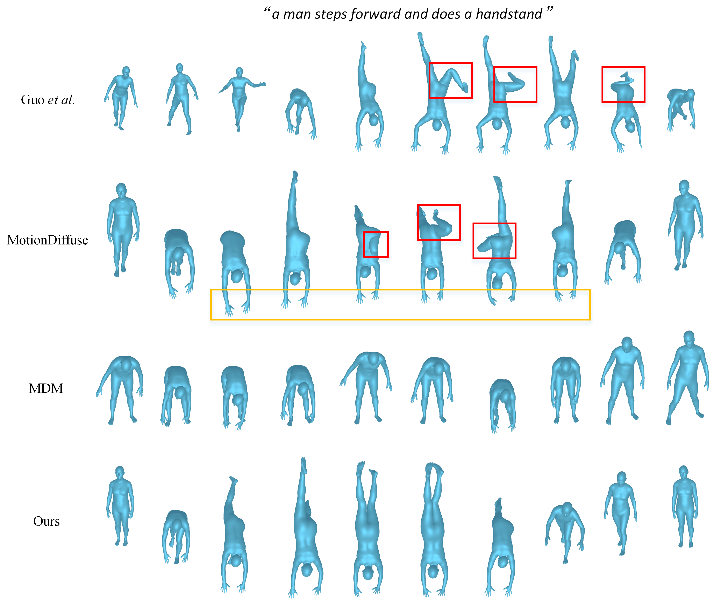

# T2M-GPT
Pytorch implementation of paper "T2M-GPT: Generating Human Motion from Textual Descriptions with Discrete Representations"


[[Project Page]](https://mael-zys.github.io/T2M-GPT/) [[Paper]](https://arxiv.org/abs/2301.06052) [[Notebook Demo]](https://colab.research.google.com/drive/1Vy69w2q2d-Hg19F-KibqG0FRdpSj3L4O?usp=sharing)


<p align="center">

</p>

If our project is helpful for your research, please consider citing :
``` 
@article{zhang2023generating,
  title={T2M-GPT: Generating Human Motion from Textual Descriptions with Discrete Representations},
  author={Zhang, Jianrong and Zhang, Yangsong and Cun, Xiaodong and Huang, Shaoli and Zhang, Yong and Zhao, Hongwei and Lu, Hongtao and Shen, Xi},
  journal={arXiv preprint arXiv:2301.06052},
  year={2023},
}
```


## Table of Content
* [1. Visual Results](#1-visual-results)
* [2. Installation](#2-installation)
* [3. Quick Start](#3-quick-start)
* [4. Train](#4-train)
* [5. Evaluation](#5-evaluation)
* [6. SMPL Mesh Rendering](#6-smpl-mesh-rendering)
* [7. Acknowledgement](#7-acknowledgement)
* [8. ChangLog](#8-changlog)


## 1. Visual Results (More results can be found in our [project page](https://mael-zys.github.io/T2M-GPT/))

<!--  -->

<p align="center">
<table>
  <tr>
    <th colspan="5">Text: a man steps forward and does a handstand.</th>
  </tr>
  <tr>
    <th>GT</th>
    <th><u><a href="https://ericguo5513.github.io/text-to-motion/"><nobr>T2M</nobr> </a></u></th>
    <th><u><a href="https://guytevet.github.io/mdm-page/"><nobr>MDM</nobr> </a></u></th>
    <th><u><a href="https://mingyuan-zhang.github.io/projects/MotionDiffuse.html"><nobr>MotionDiffuse</nobr> </a></u></th>
    <th>Ours</th>
  </tr>
  
  <tr>
    <td></td>
    <td></td>
    <td></td>
    <td></td>
    <td></td>
  </tr>

  <tr>
    <th colspan="5">Text: A man rises from the ground, walks in a circle and sits back down on the ground.</th>
  </tr>
  <tr>
    <th>GT</th>
    <th><u><a href="https://ericguo5513.github.io/text-to-motion/"><nobr>T2M</nobr> </a></u></th>
    <th><u><a href="https://guytevet.github.io/mdm-page/"><nobr>MDM</nobr> </a></u></th>
    <th><u><a href="https://mingyuan-zhang.github.io/projects/MotionDiffuse.html"><nobr>MotionDiffuse</nobr> </a></u></th>
    <th>Ours</th>
  </tr>
  
  <tr>
    <td></td>
    <td></td>
    <td></td>
    <td></td>
    <td></td>
  </tr>
</table>
</p>
 
## 2. Installation

### 2.1. Environment


Our model can be learnt in a **single GPU V100-32G**

```bash
conda env create -f environment.yml
conda activate T2M-GPT
```

The code was tested on Python 3.8 and PyTorch 1.8.1.


### 2.2. Dependencies

```bash
bash dataset/prepare/download_glove.sh
```


### 2.3. Datasets


We are using two 3D human motion-language dataset: HumanML3D and KIT-ML. For both datasets, you could find the details as well as download link [[here]](https://github.com/EricGuo5513/HumanML3D).   

Take HumanML3D for an example, the file directory should look like this:  
```
./dataset/HumanML3D/
├── new_joint_vecs/
├── texts/
├── Mean.npy # same as in [HumanML3D](https://github.com/EricGuo5513/HumanML3D) 
├── Std.npy # same as in [HumanML3D](https://github.com/EricGuo5513/HumanML3D) 
├── train.txt
├── val.txt
├── test.txt
├── train_val.txt
└── all.txt
```


### 2.4. Motion & text feature extractors:

We use the same extractors provided by [t2m](https://github.com/EricGuo5513/text-to-motion) to evaluate our generated motions. Please download the extractors.

```bash
bash dataset/prepare/download_extractor.sh
```

### 2.5. Pre-trained models 

The pretrained model files will be stored in the 'pretrained' folder:
```bash
bash dataset/prepare/download_model.sh
```


### 2.6. Render SMPL mesh (optional)

If you want to render the generated motion, you need to install:

```bash
sudo sh dataset/prepare/download_smpl.sh
conda install -c menpo osmesa
conda install h5py
conda install -c conda-forge shapely pyrender trimesh mapbox_earcut
```


## 3. Quick Start

A quick start guide of how to use our code is available in [demo.ipynb](https://colab.research.google.com/drive/1Vy69w2q2d-Hg19F-KibqG0FRdpSj3L4O?usp=sharing)

<p align="center">

</p>


## 4. Train

Note that, for kit dataset, just need to set '--dataname kit'.

### 4.1. VQ-VAE 

The results are saved in the folder output.

<details>
<summary>
VQ training
</summary>

```bash
python3 train_vq.py \
--batch-size 256 \
--lr 2e-4 \
--total-iter 300000 \
--lr-scheduler 200000 \
--nb-code 512 \
--down-t 2 \
--depth 3 \
--dilation-growth-rate 3 \
--out-dir output \
--dataname t2m \
--vq-act relu \
--quantizer ema_reset \
--loss-vel 0.5 \
--recons-loss l1_smooth \
--exp-name VQVAE
```

</details>

### 4.2. GPT 

The results are saved in the folder output.

<details>
<summary>
GPT training
</summary>

```bash
python3 train_t2m_trans.py  \
--exp-name GPT \
--batch-size 128 \
--num-layers 9 \
--embed-dim-gpt 1024 \
--nb-code 512 \
--n-head-gpt 16 \
--block-size 51 \
--ff-rate 4 \
--drop-out-rate 0.1 \
--resume-pth output/VQVAE/net_last.pth \
--vq-name VQVAE \
--out-dir output \
--total-iter 300000 \
--lr-scheduler 150000 \
--lr 0.0001 \
--dataname t2m \
--down-t 2 \
--depth 3 \
--quantizer ema_reset \
--eval-iter 10000 \
--pkeep 0.5 \
--dilation-growth-rate 3 \
--vq-act relu
```

</details>

## 5. Evaluation 

### 5.1. VQ-VAE 
<details>
<summary>
VQ eval
</summary>

```bash
python3 VQ_eval.py \
--batch-size 256 \
--lr 2e-4 \
--total-iter 300000 \
--lr-scheduler 200000 \
--nb-code 512 \
--down-t 2 \
--depth 3 \
--dilation-growth-rate 3 \
--out-dir output \
--dataname t2m \
--vq-act relu \
--quantizer ema_reset \
--loss-vel 0.5 \
--recons-loss l1_smooth \
--exp-name TEST_VQVAE \
--resume-pth output/VQVAE/net_last.pth
```

</details>

### 5.2. GPT

<details>
<summary>
GPT eval
</summary>

Follow the evaluation setting of [text-to-motion](https://github.com/EricGuo5513/text-to-motion), we evaluate our model 20 times and report the average result. Due to the multimodality part where we should generate 30 motions from the same text, the evaluation takes a long time.

```bash
python3 GPT_eval_multi.py  \
--exp-name TEST_GPT \
--batch-size 128 \
--num-layers 9 \
--embed-dim-gpt 1024 \
--nb-code 512 \
--n-head-gpt 16 \
--block-size 51 \
--ff-rate 4 \
--drop-out-rate 0.1 \
--resume-pth output/VQVAE/net_last.pth \
--vq-name VQVAE \
--out-dir output \
--total-iter 300000 \
--lr-scheduler 150000 \
--lr 0.0001 \
--dataname t2m \
--down-t 2 \
--depth 3 \
--quantizer ema_reset \
--eval-iter 10000 \
--pkeep 0.5 \
--dilation-growth-rate 3 \
--vq-act relu \
--resume-gpt output/GPT/net_best_fid.pth
```

</details>


## 6. SMPL Mesh Rendering 

<details>
<summary>
SMPL Mesh Rendering 
</summary>

You should input the npy folder address and the motion names. Here is an example:

```bash
python3 render_final.py --filedir output/TEST_GPT/ --motion-list 000019 005485
```

</details>

### 7. Acknowledgement

We appreciate helps from :  

* public code like [text-to-motion](https://github.com/EricGuo5513/text-to-motion), [TM2T](https://github.com/EricGuo5513/TM2T), [MDM](https://github.com/GuyTevet/motion-diffusion-model), [MotionDiffuse](https://github.com/mingyuan-zhang/MotionDiffuse) etc.
* <a href='https://mathis.petrovich.fr/'>Mathis Petrovich</a>, <a href='https://dulucas.github.io/'>Yuming Du</a>, <a href='https://github.com/yingyichen-cyy'>Yingyi Chen</a>, <a href='https://dexiong.me/'>Dexiong Chen</a> and <a href='https://xuelin-chen.github.io/'>Xuelin Chen</a> for inspiring discussions and valuable feedback.

### 8. ChangLog

